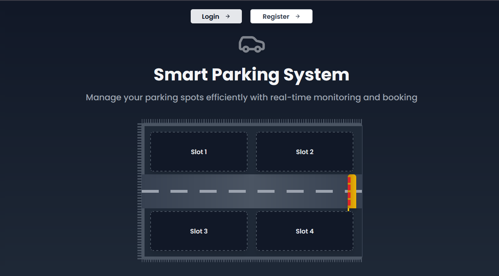
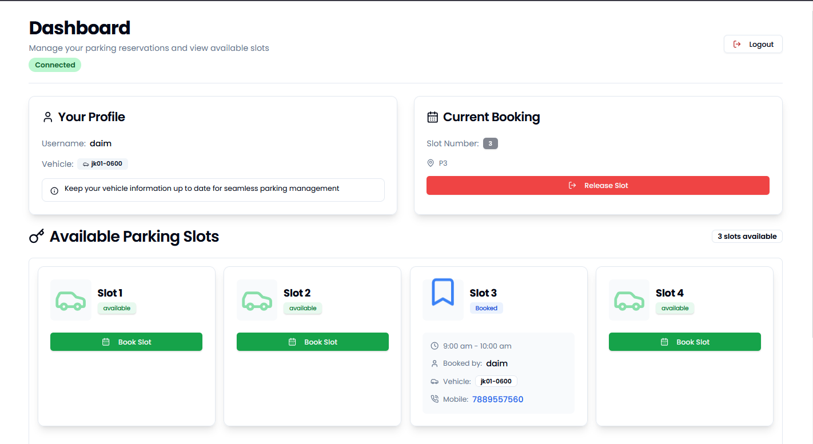

# Smart Parking System

A modern web-based parking management system built with Next.js, Socket.IO, and WebSocket for real-time parking slot monitoring and booking.




## Features

- 🚗 Real-time parking slot monitoring
- 📱 User authentication and registration
- 🎫 Slot booking and management
- ⚡ Live updates using WebSocket
- 🌙 Dark/Light mode support
- 📊 Interactive dashboard
- 🔔 Real-time notifications
- 📱 Responsive design

## Tech Stack

- **Frontend**

  - Next.js 14 (App Router)
  - TypeScript
  - Tailwind CSS
  - Socket.IO Client
  - Lucide Icons
  - shadcn/ui Components

- **Backend**
  - Node.js
  - Express.js
  - WebSocket
  - Socket.IO
  - MongoDB
  - JWT Authentication

## Prerequisites

Before you begin, ensure you have the following installed:

- Node.js (v18 or higher)
- npm or yarn
- MongoDB

## Installation

1. **Clone the repository**

```bash
git clone https://github.com/devdaim6/iot-smart-parking-frontend.git
cd iot-smart-parking-frontend
```

2. **Install dependencies**

```bash
npm install
# or
yarn install
```

3. **Environment Setup**

Create a `.env` file in the root directory:

```env
NEXT_PUBLIC_API_URL="http://localhost:5000"
```

4. **Start the development server**

```bash
npm run dev
# or
yarn dev
```

The application will be available at `http://localhost:3000`

## Project Structure

```
smart-parking-system/
├── app/                    # Next.js app directory
│   ├── (auth)/            # Authentication routes
│   ├── dashboard/         # Dashboard pages
│   └── layout.tsx         # Root layout
├── components/            # Reusable components
│   ├── ui/               # UI components
│   └── theme-provider.tsx # Theme configuration
├── hooks/                # Custom React hooks
├── lib/                  # Utility functions
├── providers/           # Context providers
└── public/              # Static assets
```

## Features in Detail

### Real-time Parking Management

- Live monitoring of parking slot status
- Automatic status updates using WebSocket
- Visual indicators for occupied/available slots

### User Management

- Secure user registration and authentication
- JWT-based session management
- User profile management

### Booking System

- Interactive slot booking interface
- Date and time selection
- Duration-based booking
- Automatic slot release

### Responsive Design

- Mobile-first approach
- Smooth animations and transitions

## API Endpoints

### Authentication

- `POST /api/auth/register` - User registration
- `POST /api/auth/login` - User login

### Parking Slots

- `GET /api/slots` - Get all parking slots
- `POST /api/slots/book` - Book a parking slot
- `POST /api/slots/release` - Release a parking slot

## WebSocket Events

### Client Events

- `parkingStatus` - Receives parking slot updates
- `triggerServo` - Controls parking gate
- `deviceCommand` - Handles device commands

### Server Events

- `connection` - Handles new client connections
- `disconnect` - Manages client disconnections
- `servoControl` - Processes servo control commands

## Acknowledgments

- [Next.js](https://nextjs.org/)
- [Socket.IO](https://socket.io/)
- [Tailwind CSS](https://tailwindcss.com/)
- [shadcn/ui](https://ui.shadcn.com/)
- [Lucide Icons](https://lucide.dev/)

## Contact

Daim Zahoor - [daimdev6+iot+support@gmail.com](mailto:daimdev6+iot+support@gmail.com)

Project Link: [https://github.com/devdaim6/iot-smart-parking-frontend](https://github.com/devdaim6/iot-smart-parking-frontend.git)
